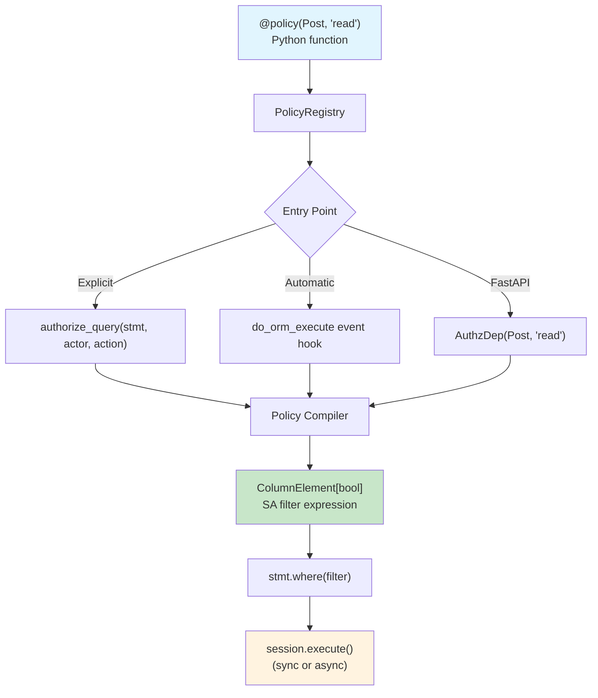

<a id="readme-top"></a>

<!-- PROJECT SHIELDS -->
[![Contributors][contributors-shield]][contributors-url]
[![Forks][forks-shield]][forks-url]
[![Stargazers][stars-shield]][stars-url]
[![Issues][issues-shield]][issues-url]
[![MIT License][license-shield]][license-url]
[![CI][ci-shield]][ci-url]
[![codecov][codecov-shield]][codecov-url]
[![PyPI version][pypi-shield]][pypi-url]


<!-- PROJECT LOGO -->
<br />
<div align="center">
  <a href="https://github.com/colbyjoines/sqla-authz">
    <picture>
      <source media="(prefers-color-scheme: dark)" srcset="docs/assets/brand/sqla-authz-logo-dark.svg">
      <source media="(prefers-color-scheme: light)" srcset="docs/assets/brand/sqla-authz-logo-light.svg">
      
    </picture>
  </a>

  <p align="center">
    <br />
    Embedded row-level authorization for SQLAlchemy 2.0.
    <br />
    Write policies as Python functions — they compile to SQL WHERE clauses at query time.
    <br />
    <br />
    <a href="https://colbyjoines.github.io/sqla-authz/"><strong>Explore the docs »</strong></a>
    <br />
    <br />
    <a href="https://colbyjoines.github.io/sqla-authz/getting-started/">Getting Started</a>
    &middot;
    <a href="https://github.com/colbyjoines/sqla-authz/issues/new?labels=bug">Report Bug</a>
    &middot;
    <a href="https://github.com/colbyjoines/sqla-authz/issues/new?labels=enhancement">Request Feature</a>
  </p>
</div>


<!-- TABLE OF CONTENTS -->
<details>
  <summary>Table of Contents</summary>
  <ol>
    <li>
      <a href="#about-the-project">About The Project</a>
      <ul>
        <li><a href="#why-sqla-authz">Why sqla-authz?</a></li>
        <li><a href="#built-with">Built With</a></li>
      </ul>
    </li>
    <li>
      <a href="#getting-started">Getting Started</a>
      <ul>
        <li><a href="#prerequisites">Prerequisites</a></li>
        <li><a href="#installation">Installation</a></li>
      </ul>
    </li>
    <li>
      <a href="#usage">Usage</a>
      <ul>
        <li><a href="#define-a-policy">Define a Policy</a></li>
        <li><a href="#apply-to-queries">Apply to Queries</a></li>
        <li><a href="#point-checks">Point Checks</a></li>
        <li><a href="#automatic-session-interception">Automatic Session Interception</a></li>
        <li><a href="#fastapi-integration">FastAPI Integration</a></li>
      </ul>
    </li>
    <li><a href="#architecture">Architecture</a></li>
    <li><a href="#roadmap">Roadmap</a></li>
    <li><a href="#contributing">Contributing</a></li>
    <li><a href="#license">License</a></li>
    <li><a href="#contact">Contact</a></li>
    <li><a href="#acknowledgments">Acknowledgments</a></li>
  </ol>
</details>


<!-- ABOUT THE PROJECT -->
## About The Project

Your application queries data, but not every user should see every row. An author sees their drafts; readers only see published posts. A support agent sees their team's tickets, not the whole company's.

You can scatter `.where()` conditions throughout your codebase, but authorization logic becomes fragile, inconsistent, and impossible to audit. **sqla-authz** lets you define these rules once as policies and applies them to every query — the database does the filtering, not Python.

Key highlights:

* **SQL-native** — policies compile to `ColumnElement[bool]` WHERE clauses; the database does the filtering
* **Pure Python** — no DSL, no config files; full IDE autocomplete, type checking, and debugging
* **Fail-closed** — missing policy = zero rows, not a data leak
* **Async-equal** — same synchronous policy code works with both `Session` and `AsyncSession`
* **Type-safe** — passes Pyright strict mode with zero errors

<p align="right">(<a href="#readme-top">back to top</a>)</p>

### Why sqla-authz?

Most authorization libraries answer a yes/no question: "can this user do this action?" That works for protecting endpoints, but not when you need to **filter a query** — "show me only the rows this user is allowed to see."

sqla-authz generates SQL WHERE clauses from your policies, so the database does the filtering. No post-query Python loops, no N+1 permission checks.

| Feature | sqla-authz | PyCasbin | Cerbos | OpenFGA |
|---------|-----------|----------|--------|---------|
| Generates SQL WHERE clauses | Yes | No | Via server | No |
| SQLAlchemy 2.0 + AsyncSession | Yes | N/A | No | N/A |
| Runs in-process (no server) | Yes | Yes | No | No |
| Policies are Python code | Yes | No (.conf) | No (YAML) | No |
| Type-safe (Pyright strict) | Yes | No | No | No |

Previously, [sqlalchemy-oso](https://github.com/osohq/oso) filled this niche but was deprecated in December 2023. sqla-authz is its spiritual successor with full SQLAlchemy 2.0 and AsyncSession support.

<p align="right">(<a href="#readme-top">back to top</a>)</p>

### Built With

* [![Python][Python-shield]][Python-url]
* [![SQLAlchemy][SQLAlchemy-shield]][SQLAlchemy-url]
* [![FastAPI][FastAPI-shield]][FastAPI-url]
* [![Pytest][Pytest-shield]][Pytest-url]

<p align="right">(<a href="#readme-top">back to top</a>)</p>


<!-- GETTING STARTED -->
## Getting Started

### Prerequisites

* Python 3.10+
* SQLAlchemy 2.0+

### Installation

1. Install the core library
   ```sh
   pip install sqla-authz
   ```
2. Or install with optional extras
   ```sh
   # With FastAPI integration
   pip install sqla-authz[fastapi]

   # With test utilities
   pip install sqla-authz[testing]

   # Everything
   pip install sqla-authz[all]
   ```
3. For development
   ```sh
   git clone https://github.com/colbyjoines/sqla-authz.git
   cd sqla-authz
   uv pip install -e ".[dev]"
   ```

<p align="right">(<a href="#readme-top">back to top</a>)</p>


<!-- USAGE EXAMPLES -->
## Usage

### Define a Policy

Policies are plain Python functions decorated with `@policy`. They receive an actor and return a SQLAlchemy filter expression:

```python
from sqlalchemy import ColumnElement, or_, true
from sqla_authz import policy

@policy(Post, "read")
def post_read_policy(actor: User) -> ColumnElement[bool]:
    if actor.role == "admin":
        return true()
    return or_(Post.is_published == True, Post.author_id == actor.id)
```

### Apply to Queries

Use `authorize_query()` to apply the policy as a WHERE clause:

```python
from sqlalchemy import select
from sqla_authz import authorize_query

stmt = select(Post).order_by(Post.created_at.desc())
stmt = authorize_query(stmt, actor=current_user, action="read")
result = session.execute(stmt)
# -> SELECT ... FROM post WHERE (is_published = true OR author_id = :id)
```

No policy registered for a model? The query returns **zero rows** — authorization is deny-by-default.

### Point Checks

Check a single resource without hitting the database:

```python
from sqla_authz import can, authorize

if can(current_user, "read", some_post):
    ...

# Or raise AuthorizationDenied if denied
authorize(current_user, "read", some_post)
```

### Automatic Session Interception

Opt-in to authorize every SELECT automatically:

```python
from sqla_authz.session import authorized_sessionmaker

Session = authorized_sessionmaker(
    bind=engine,
    actor=get_current_user,
    action="read",
)
```

### FastAPI Integration

Inject authorized query results directly into your endpoints:

```python
from sqla_authz.integrations.fastapi import AuthzDep, configure_authz

configure_authz(app, get_actor=get_current_user, get_session=get_db)

@app.get("/posts")
async def list_posts(posts: AuthzDep(Post, "read")):
    return posts

@app.get("/posts/{id}")
async def get_post(post: AuthzDep(Post, "read", id_param="id")):
    return post
```

_For more examples and advanced patterns (predicates, relationship traversal, audit logging, debugging), please refer to the [Documentation](https://colbyjoines.github.io/sqla-authz/)._

<p align="right">(<a href="#readme-top">back to top</a>)</p>


<!-- ARCHITECTURE -->
## Architecture



**Key design decisions:**

- **Explicit by default** — `authorize_query()` is visible and greppable. Automatic session interception is opt-in.
- **SQL-native** — policies compile to `ColumnElement[bool]`. The database does the filtering, not Python.
- **Async-equal** — same code for `Session` and `AsyncSession`. Filter construction is pure Python with no I/O.
- **Fail-closed** — missing policy = zero rows, not a data leak.

<p align="right">(<a href="#readme-top">back to top</a>)</p>


<!-- LICENSE -->
## License

Distributed under the MIT License. See `LICENSE` for more information.

<p align="right">(<a href="#readme-top">back to top</a>)</p>


<!-- CONTACT -->
## Contact

Colby Joines - cjoines@blueally.com

Project Link: [https://github.com/colbyjoines/sqla-authz](https://github.com/colbyjoines/sqla-authz)

<p align="right">(<a href="#readme-top">back to top</a>)</p>


<!-- ACKNOWLEDGMENTS -->
## Acknowledgments

* [Oso / sqlalchemy-oso](https://github.com/osohq/oso) — the original inspiration; deprecated Dec 2023
* [SQLAlchemy](https://www.sqlalchemy.org/) — the foundation this library builds on
* [Best-README-Template](https://github.com/othneildrew/Best-README-Template) — this README's structure

<p align="right">(<a href="#readme-top">back to top</a>)</p>


<!-- MARKDOWN LINKS & IMAGES -->
<!-- https://www.markdownguide.org/basic-syntax/#reference-style-links -->
[contributors-shield]: https://img.shields.io/github/contributors/colbyjoines/sqla-authz.svg?style=for-the-badge
[contributors-url]: https://github.com/colbyjoines/sqla-authz/graphs/contributors
[forks-shield]: https://img.shields.io/github/forks/colbyjoines/sqla-authz.svg?style=for-the-badge
[forks-url]: https://github.com/colbyjoines/sqla-authz/network/members
[stars-shield]: https://img.shields.io/github/stars/colbyjoines/sqla-authz.svg?style=for-the-badge
[stars-url]: https://github.com/colbyjoines/sqla-authz/stargazers
[issues-shield]: https://img.shields.io/github/issues/colbyjoines/sqla-authz.svg?style=for-the-badge
[issues-url]: https://github.com/colbyjoines/sqla-authz/issues
[license-shield]: https://img.shields.io/github/license/colbyjoines/sqla-authz.svg?style=for-the-badge
[license-url]: https://github.com/colbyjoines/sqla-authz/blob/main/LICENSE
[ci-shield]: https://img.shields.io/github/actions/workflow/status/colbyjoines/sqla-authz/ci.yml?style=for-the-badge&label=CI
[ci-url]: https://github.com/colbyjoines/sqla-authz/actions/workflows/ci.yml
[codecov-shield]: https://img.shields.io/codecov/c/github/colbyjoines/sqla-authz?style=for-the-badge
[codecov-url]: https://codecov.io/gh/colbyjoines/sqla-authz
[pypi-shield]: https://img.shields.io/pypi/v/sqla-authz?style=for-the-badge
[pypi-url]: https://pypi.org/project/sqla-authz/
[Python-shield]: https://img.shields.io/badge/Python-3.10+-0f172a?style=for-the-badge&logo=python&logoColor=white
[Python-url]: https://www.python.org/
[SQLAlchemy-shield]: https://img.shields.io/badge/SQLAlchemy-2.0+-0f172a?style=for-the-badge&logo=sqlalchemy&logoColor=white
[SQLAlchemy-url]: https://www.sqlalchemy.org/
[FastAPI-shield]: https://img.shields.io/badge/FastAPI-0f172a?style=for-the-badge&logo=fastapi&logoColor=white
[FastAPI-url]: https://fastapi.tiangolo.com/
[Pytest-shield]: https://img.shields.io/badge/Pytest-0f172a?style=for-the-badge&logo=pytest&logoColor=white
[Pytest-url]: https://docs.pytest.org/
