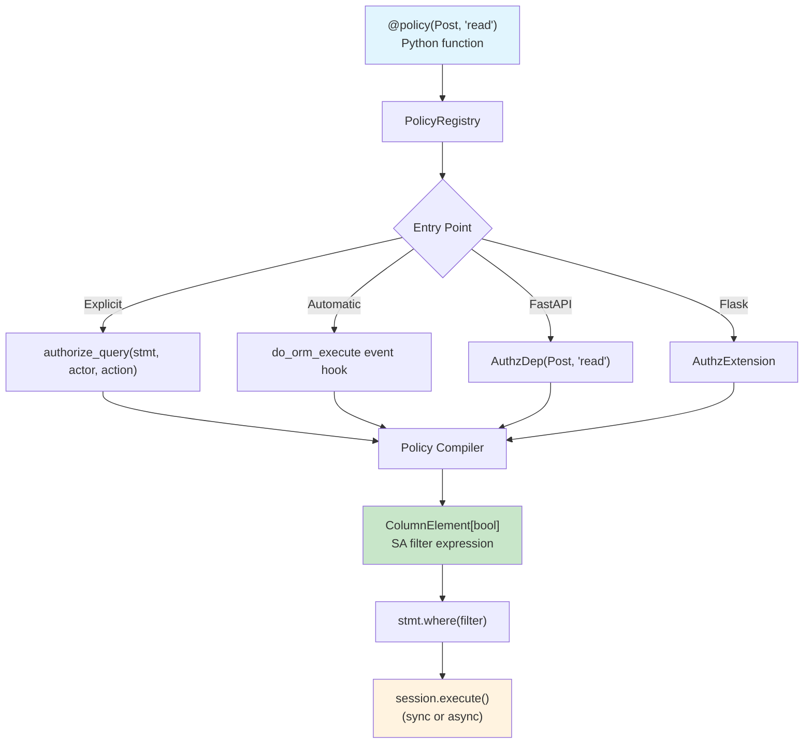

# sqla-authz

[](https://github.com/colbyjoines/sqla-authz/actions/workflows/ci.yml)
[](https://badge.fury.io/py/sqla-authz)
[](https://pypi.org/project/sqla-authz/)
[](https://codecov.io/gh/colbyjoines/sqla-authz)
[](https://opensource.org/licenses/MIT)

**Declarative authorization that compiles to SQL WHERE clauses.**

An embedded, open-source, SQLAlchemy 2.0-native authorization library. Define policies in Python, get SQL filters automatically -- no external servers, no network round-trips, no custom DSLs.

Fills the vacuum left by [Oso's deprecation](https://github.com/osohq/oso) (December 2023). No maintained alternative exists that generates SQL query filters for SQLAlchemy 2.0.

## Why sqla-authz?

| Feature | sqla-authz | sqlalchemy-oso | PyCasbin | Cerbos |
|---------|-----------|---------------|----------|--------|
| SQL WHERE clause generation | Yes | Yes (deprecated) | No | Yes (via server) |
| SQLAlchemy 2.0 (`select()`) | Yes | No | N/A | Yes |
| AsyncSession | Yes | No | N/A | No |
| Embedded (no server) | Yes | Yes | Yes | No |
| Python-native policies | Yes | No (Polar DSL) | No (.conf files) | No (YAML) |
| Type-safe (pyright strict) | Yes | No | No | No |

## Quick Start

```python
from sqla_authz import policy, authorize_query
from sqlalchemy import select, ColumnElement, or_

# 1. Define a policy
@policy(Post, "read")
def post_read_policy(actor: User) -> ColumnElement[bool]:
    return or_(
        Post.is_published == True,
        Post.author_id == actor.id,
    )

# 2. Apply authorization to any query
stmt = select(Post).order_by(Post.created_at.desc())
stmt = authorize_query(stmt, actor=current_user, action="read")
result = await session.execute(stmt)
posts = result.scalars().all()
# SQL: SELECT ... FROM post WHERE (is_published = true OR author_id = :id)
```

## Installation

```bash
pip install sqla-authz

# With FastAPI integration
pip install sqla-authz[fastapi]

# With Flask integration
pip install sqla-authz[flask]

# With test utilities
pip install sqla-authz[testing]

# Everything
pip install sqla-authz[all]
```

## Features

- SQLAlchemy 2.0 `select()` style exclusively
- Both sync `Session` and `AsyncSession`
- Relationship traversal via `has()`/`any()` (compiles to EXISTS)
- Composable predicates with `&`, `|`, `~` operators
- FastAPI integration via dependency injection (`AuthzDep`)
- Flask integration via extension (`AuthzExtension`)
- Point checks: `can(actor, action, resource)` and `authorize(actor, action, resource)`
- Audit logging for authorization decisions
- Consumer test utilities (`sqla_authz.testing`)
- pyright strict mode compatible
- Zero runtime dependencies beyond SQLAlchemy

## Architecture



### Key Design Decisions

- **Pure Python policies** -- no DSL, no config files. Type-safe, IDE-friendly, debuggable.
- **SQL-native** -- policies compile to `ColumnElement[bool]`. The database does the filtering.
- **Explicit by default** -- `authorize_query()` is visible and greppable. Automatic mode is opt-in.
- **Async-equal** -- same compilation code for `Session` and `AsyncSession`. Filter construction is pure Python (no I/O).
- **Fail-closed** -- missing policy = zero rows, not a data leak.

## Documentation

- [Technical Design Document](docs/TDD.md) -- Full architecture and API specification
- [Research Findings](docs/research/) -- Prior art analysis and design rationale

## Contributing

```bash
# Clone and install dev dependencies
git clone https://github.com/colbyjoines/sqla-authz.git
cd sqla-authz
uv pip install -e ".[dev]"

# Run tests
pytest

# Lint and format
ruff check src/ tests/
ruff format src/ tests/

# Type check
pyright src/
```

## Status

**Phase 3: Complete.** Core MVP, integrations (FastAPI, Flask), testing utilities, audit logging, and benchmarks are implemented.

## License

MIT
