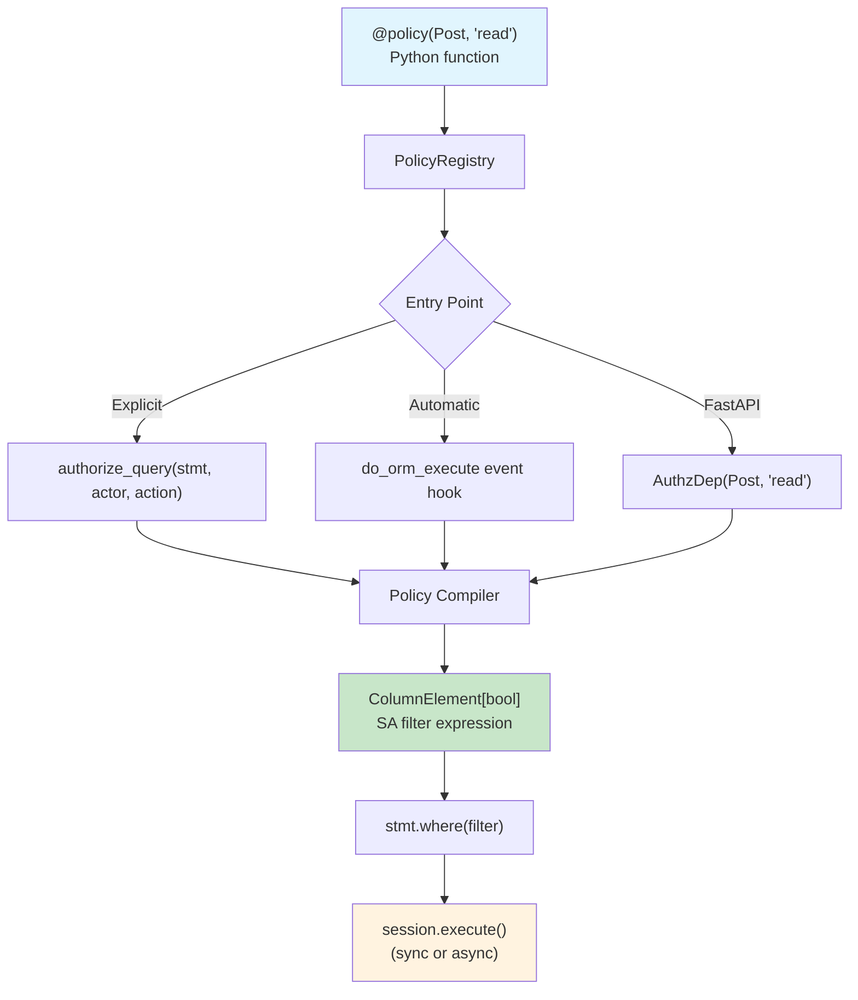

# sqla-authz

[](https://github.com/colbyjoines/sqla-authz/actions/workflows/ci.yml)
[](https://badge.fury.io/py/sqla-authz)
[](https://pypi.org/project/sqla-authz/)
[](https://codecov.io/gh/colbyjoines/sqla-authz)
[](https://opensource.org/licenses/MIT)

Embeddable row-level authorization for SQLAlchemy 2.0. Write policies as Python functions — they compile to SQL WHERE clauses at query time.

## The Problem

Your application queries data, but not every user should see every row. An author sees their drafts; readers only see published posts. A support agent sees their team's tickets, not the whole company's.

You can scatter `.where()` conditions throughout your codebase, but authorization logic becomes fragile, inconsistent, and impossible to audit. sqla-authz lets you define these rules once as policies and apply them to every query.

## Quick Start

```python
from sqlalchemy import select, ColumnElement, or_, true
from sqla_authz import policy, authorize_query

@policy(Post, "read")
def post_read_policy(actor: User) -> ColumnElement[bool]:
    # Admins see everything; others see published posts + their own drafts
    if actor.role == "admin":
        return true()
    return or_(Post.is_published == True, Post.author_id == actor.id)

# Apply to any SELECT — the policy becomes a WHERE clause
stmt = select(Post).order_by(Post.created_at.desc())
stmt = authorize_query(stmt, actor=current_user, action="read")
result = session.execute(stmt)
# → SELECT ... FROM post WHERE (is_published = true OR author_id = :id)
```

No policy for a model? The query returns zero rows — authorization is deny-by-default.

## Installation

```bash
pip install sqla-authz

# With FastAPI integration
pip install sqla-authz[fastapi]

# With test utilities
pip install sqla-authz[testing]
```

## Why sqla-authz?

Most authorization libraries answer a yes/no question: "can this user do this action?" That works for protecting endpoints, but not when you need to **filter a query** — "show me only the rows this user is allowed to see."

sqla-authz generates SQL WHERE clauses from your policies, so the database does the filtering. No post-query Python loops, no N+1 permission checks.

| Feature | sqla-authz | PyCasbin | Cerbos | OpenFGA |
|---------|-----------|----------|--------|---------|
| Generates SQL WHERE clauses | Yes | No | Via server | No |
| SQLAlchemy 2.0 + AsyncSession | Yes | N/A | No | N/A |
| Runs in-process (no server) | Yes | Yes | No | No |
| Policies are Python code | Yes | No (.conf) | No (YAML) | No |
| Type-safe (pyright strict) | Yes | No | No | No |

Previously, [sqlalchemy-oso](https://github.com/osohq/oso) filled this niche but was deprecated in December 2023. sqla-authz is its successor with full SQLAlchemy 2.0 and AsyncSession support.

## Architecture



### Key Design Decisions

- **Pure Python policies** — no DSL, no config files. Full IDE support: autocomplete, type checking, debugging.
- **SQL-native** — policies compile to `ColumnElement[bool]`. The database does the filtering, not Python.
- **Explicit by default** — `authorize_query()` is visible and greppable. Automatic session interception is opt-in.
- **Async-equal** — same code for `Session` and `AsyncSession`. Filter construction is pure Python with no I/O.
- **Fail-closed** — missing policy = zero rows, not a data leak.

## Documentation

Full documentation at [colbyjoines.github.io/sqla-authz](https://colbyjoines.github.io/sqla-authz/).

## Contributing

```bash
git clone https://github.com/colbyjoines/sqla-authz.git
cd sqla-authz
uv pip install -e ".[dev]"

pytest                      # Run tests
ruff check src/ tests/      # Lint
pyright src/                # Type check
```

## License

MIT
