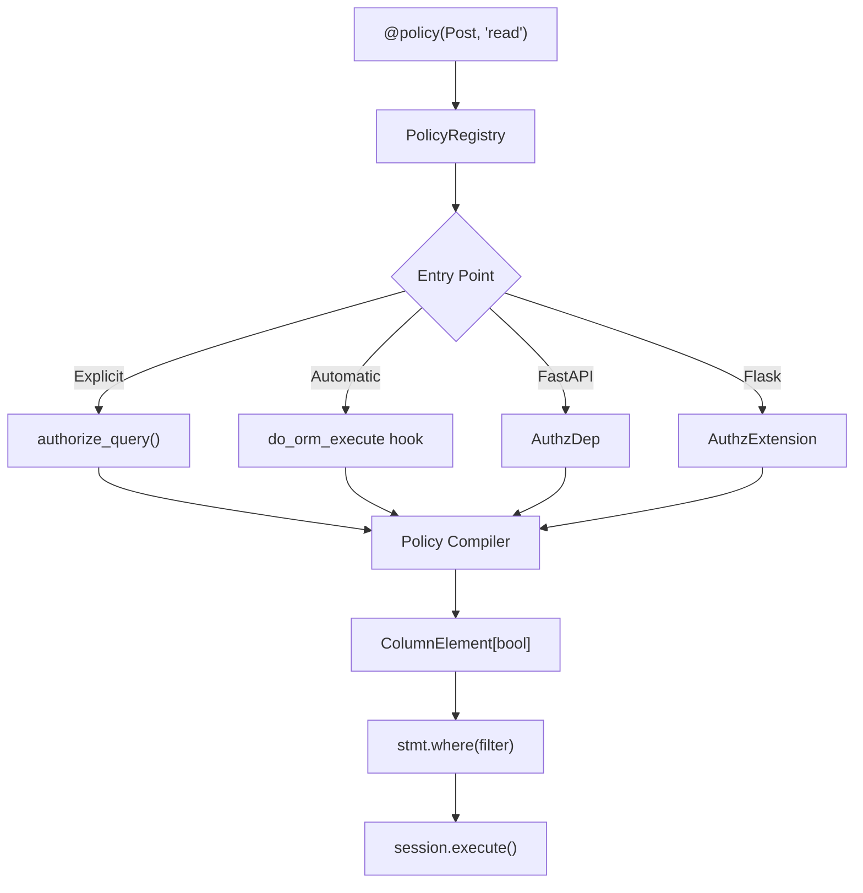
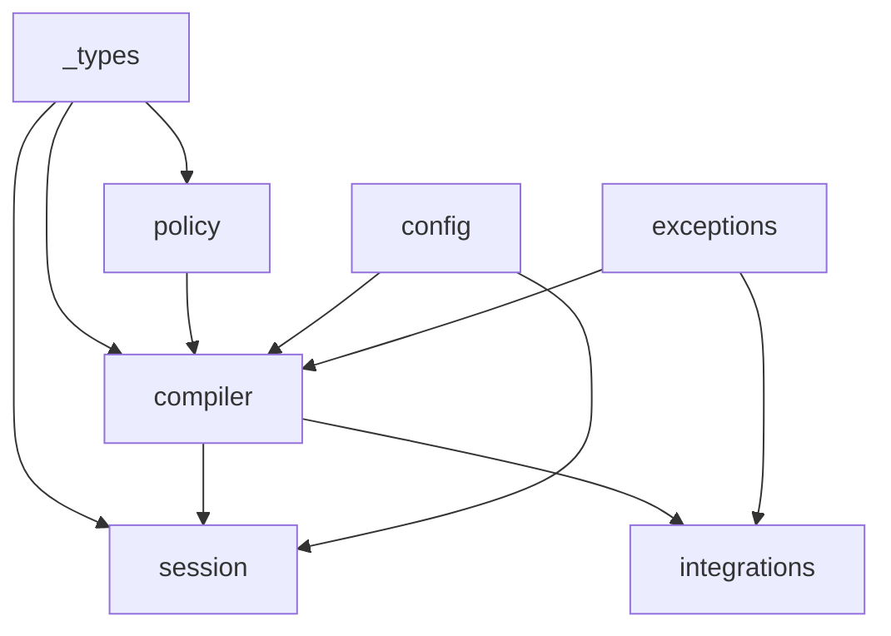

# Architecture & Design Decisions

This document explains the architectural shape of `sqla-authz` and records the reasoning behind each significant design choice. It is intended for contributors and for teams evaluating the library for production use.

---

## Architecture Overview

The following diagram shows the full request flow, from policy registration through SQL execution.



The compiler is a pure function: given a `(model, actor, action)` triple, it looks up registered policies and reduces them to a single `ColumnElement[bool]`. No I/O, no side effects. The resulting expression is appended to the caller's `select()` statement before it reaches the database driver.

---

## Dependency DAG

Module-level imports form a strict DAG — no cycles.



`_types.py` is the only shared leaf. `policy`, `compiler`, `session`, `config`, and `exceptions` form a partial order. Integration modules (`fastapi`, `flask`) are terminal nodes — nothing in the core imports them.

---

## ADR 1: Pure Python Policies, Not a DSL

### Context

Authorization libraries commonly introduce domain-specific languages to express rules declaratively. Oso uses Polar. OPA uses Rego. Casbin uses a .conf dialect. Each DSL provides a concise notation for its target domain but introduces a learning curve, a separate runtime, and an impedance mismatch with the host language's type system and tooling.

### Decision

Policies are `@policy`-decorated Python functions that return `ColumnElement[bool]`. No Polar. No YAML. No `.conf` files.

```python
@policy(Post, "read")
def read_post(actor: User, Post: type) -> ColumnElement[bool]:
    return or_(
        Post.is_published == true(),
        Post.owner_id == actor.id,
    )
```

### Consequences

**Positive:**

- **Type-safe end-to-end.** pyright validates policy functions against the `ColumnElement[bool]` return type. Model attribute access is validated against the ORM model. Typos are caught at development time, not at query time.
- **Full IDE support.** Autocomplete, go-to-definition, and refactoring tools work on policy code because it is plain Python.
- **No learning curve.** Any developer who knows SQLAlchemy can write policies immediately.
- **Composable.** Policies are functions. They can call other functions, share helpers, and be unit-tested in isolation without a running database.
- **No separate process.** No Rust FFI, no Polar VM, no subprocess — the entire policy evaluation pipeline executes in the Python interpreter.

**Negative:**

- **Less declarative.** Polar rules with pattern matching are more concise for complex role hierarchies. Python requires more explicit branching.
- **No hot-reload.** Policies are registered at import time. Changing a policy requires a process restart (same as any Python code change).

---

## ADR 2: Explicit `authorize_query()` as Primary API

### Context

The most natural API for an authorization library that integrates with an ORM is to make authorization invisible — wrap the session, intercept queries, and apply filters automatically. `sqlalchemy-oso` followed this pattern via `authorized_sessionmaker`. The appeal is zero boilerplate at the call site.

Automatic interception has real costs: it is invisible in code reviews, difficult to grep for, and produces surprising behavior when a query bypasses the session wrapper. Debugging a missing WHERE clause requires tracing event hook chains rather than reading the call site.

### Decision

The primary API is the explicit `authorize_query()` function. Automatic session interception via `do_orm_execute` is opt-in only.

```python
# Explicit — visible, greppable, debuggable
stmt = authorize_query(select(Post), actor=current_user, action="read")
posts = session.scalars(stmt).all()

# Automatic — opt-in, available when ergonomics matter more than visibility
AutoSession = authorized_sessionmaker(bind=engine, actor_fn=get_current_user, action="read")
```

### Consequences

**Positive:**

- **Visible in code review.** Every authorized query is an explicit call. Reviewers can see exactly where authorization is applied and where it is deliberately bypassed.
- **Greppable.** `grep -r authorize_query` finds every authorization boundary in the codebase.
- **Debuggable.** The compiled `select()` statement can be printed or logged before execution. No event hook tracing required.
- **Composable.** `authorize_query()` returns a standard `Select` — it can be further filtered, paginated, or joined before execution.
- **Works everywhere.** No session subclass required. Works with any SQLAlchemy `Session`, `AsyncSession`, or raw `Connection`.

**Negative:**

- **More boilerplate.** Every call site must explicitly call `authorize_query()`. This is roughly one extra line per query.
- **Requires discipline.** Developers can forget to call `authorize_query()`. Automatic interception makes omission impossible (within the wrapped session). Mitigation: the `do_orm_execute` opt-in is available for teams where this risk is unacceptable.

---

## ADR 3: `ColumnElement[bool]` as Universal Output

### Context

Authorization filter systems commonly define an intermediate representation — an AST or a protocol object that abstracts over the target query language. This enables serialization, caching, and multi-backend support. It also adds complexity: the intermediate representation must be maintained, documented, and kept in sync with the target language.

### Decision

Policies return `ColumnElement[bool]` directly. There is no intermediate representation in v1.

```python
# Policy function return type
def read_post(actor: User, Post: type) -> ColumnElement[bool]:
    return Post.owner_id == actor.id
```

The compiler OR-reduces multiple policies and appends the result directly to the `select()` statement.

### Consequences

**Positive:**

- **SQLAlchemy-native.** `ColumnElement[bool]` is the type used throughout SQLAlchemy for filter expressions. No translation layer, no impedance mismatch.
- **Composable.** Policy outputs are first-class SQLAlchemy expressions. They can be combined with `and_()`, `or_()`, `not_()`, and any other SQLAlchemy construct.
- **No extra abstraction to learn.** Developers who know SQLAlchemy already know the output type.
- **Accurate type errors.** pyright catches `ColumnElement[bool]` vs `bool` mismatches at development time.

**Negative:**

- **Database coupling.** Policies that use database-specific constructs (PostgreSQL JSON operators, for example) are not portable across databases. This is an acceptable tradeoff for v1.
- **No serialization.** `ColumnElement[bool]` expressions cannot be serialized to JSON or cached across process boundaries without a custom serialization layer (not in scope for v1).

---

## ADR 4: Deny by Default

### Context

Authorization systems have two meaningful defaults when no policy matches a `(model, action)` pair: allow (open) or deny (closed). The allow default reduces friction during development but produces data leaks when policies are missing. The deny default requires explicit policies for every permitted action but eliminates an entire class of authorization bypass.

### Decision

Missing policy → `WHERE FALSE` (zero rows returned). This is configurable: set `no_policy_behavior="raise"` to raise `NoPolicyError` instead.

```python
# Default: silent deny (WHERE FALSE)
stmt = authorize_query(select(Post), actor=actor, action="nonexistent")
# Returns empty result set

# Configured: raise on missing policy
configure(no_policy_behavior="raise")
stmt = authorize_query(select(Post), actor=actor, action="nonexistent")
# Raises NoPolicyError
```

### Consequences

**Positive:**

- **Fail-closed.** A missing `@policy` declaration produces zero rows, not all rows. Authorization gaps are data-silent rather than data-leaking.
- **Safe during development.** Adding a new model or action does not automatically expose data. Developers must explicitly write a policy before data becomes visible.
- **Consistent behavior.** `WHERE FALSE` is a valid SQL expression. The query executes normally; it simply returns no rows. No special-casing required in application code.

**Negative:**

- **Friction during development.** Every new `(model, action)` pair requires a policy before queries return results. This is intentional but can surprise developers new to the library.
- **Silent failures.** The default `WHERE FALSE` behavior means a missing policy produces empty results rather than an error. Teams that prefer loud failures should configure `no_policy_behavior="raise"`.

---

## ADR 5: Sync Compilation, Async Execution

### Context

SQLAlchemy 2.0 supports both synchronous `Session` and asynchronous `AsyncSession`. A naive implementation of `AsyncSession` authorization might make the policy compilation pipeline async to "match" the session type. This creates unnecessary complexity: async functions cannot be called from sync contexts, making shared policy code impossible.

Critically, the `do_orm_execute` event hook (used for automatic session interception) fires on the inner synchronous session even when the outer session is `AsyncSession`. Event handlers are always synchronous in SQLAlchemy's event system.

### Decision

The entire policy compilation pipeline — policy lookup, expression evaluation, filter construction — is synchronous. No `async def` in the compiler or policy modules. Async execution is handled exclusively by the SQLAlchemy session layer.

```python
# Same policy function works for sync and async sessions
@policy(Post, "read")
def read_post(actor: User, Post: type) -> ColumnElement[bool]:
    return Post.owner_id == actor.id

# Sync session
stmt = authorize_query(select(Post), actor=actor, action="read")
posts = session.scalars(stmt).all()

# Async session — identical policy, different session type
stmt = authorize_query(select(Post), actor=actor, action="read")
posts = await async_session.scalars(stmt)
```

### Consequences

**Positive:**

- **Single policy codebase.** Policies are written once and work in both sync and async contexts.
- **No `async def` contagion.** Policy authors do not need to understand async/await to write correct policies.
- **Compatible with `do_orm_execute`.** The automatic interception hook fires synchronously. A sync-only compiler is compatible by design.
- **Simpler testing.** Policy functions can be unit-tested without an event loop.

**Negative:**

- **No async policy resolution.** Policies cannot perform async I/O (database lookups, cache reads) during compilation. All information needed to construct the filter must be available synchronously at call time (typically from the actor object or from Python-level context). This is an intentional constraint — authorization filter construction should not require I/O.

---

## ADR 6: EXISTS over JOIN

### Context

Relationship traversal in authorization filters has two standard SQL implementations: JOIN and EXISTS subquery. JOIN produces a flat result where rows are multiplied by matching relationship rows (a post with three matching comments produces three result rows). EXISTS produces a correlated subquery that returns at most one row per root entity regardless of how many relationship rows match.

### Decision

Relationship traversal uses `has()` (many-to-one) and `any()` (one-to-many), which SQLAlchemy compiles to EXISTS subqueries. JOIN-based traversal is not the default.

```python
# has() — many-to-one (Comment → Post)
@policy(Comment, "read")
def read_comment(actor: User, Comment: type) -> ColumnElement[bool]:
    return Comment.post.has(Post.owner_id == actor.id)

# any() — one-to-many (Post → Comments)
@policy(Post, "read")
def read_post_with_comments(actor: User, Post: type) -> ColumnElement[bool]:
    return Post.comments.any(Comment.is_approved == true())
```

The compiler selects `has()` vs `any()` automatically based on `sqlalchemy.inspect()` relationship direction (`MANYTOONE` vs `ONETOMANY`/`MANYTOMANY`).

### Consequences

**Positive:**

- **No duplicate rows.** EXISTS returns at most one row per root entity regardless of relationship cardinality. JOIN multiplies rows, requiring explicit `DISTINCT` or post-processing deduplication.
- **Correct for all cardinalities.** The same traversal pattern works for one-to-one, one-to-many, many-to-one, and many-to-many relationships without adjustment.
- **Database-optimized.** Modern database query planners (PostgreSQL, SQLite) handle correlated EXISTS subqueries efficiently. In many cases EXISTS outperforms JOIN for authorization filters because it short-circuits on the first matching row.
- **Composable.** EXISTS subqueries nest cleanly. Traversing `Comment → Post → Organization` chains `has()` calls without result set explosion.

**Negative:**

- **Subquery overhead for simple cases.** For a simple many-to-one relationship with a small parent table, a JOIN might be marginally faster due to lower query planning overhead. In practice this difference is negligible for authorization filters.
- **Less readable raw SQL.** The generated SQL for nested EXISTS is more verbose than an equivalent JOIN chain. This matters for debugging raw queries but not for application correctness.
