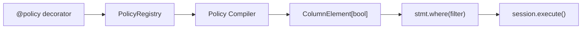

# Core Concepts

sqla-authz is built around one idea: **authorization rules are filter expressions**. Instead of checking permission and then querying, you express permission _as_ a query predicate, and the database enforces it.

## How the Pieces Fit Together



At import time, `@policy` registers functions in the `PolicyRegistry`. When you call `authorize_query()`, the compiler looks up the registered functions, calls them with the current actor, combines the results, and attaches the final expression to your statement as a `WHERE` clause. Your session executes the statement as normal.

---

## Policies

A policy is a plain Python function decorated with `@policy(Model, "action")`. It receives the current actor and returns a SQLAlchemy `ColumnElement[bool]` — the same type you would pass to `.where()`.

```python
from sqlalchemy import ColumnElement, or_
from sqla_authz import policy


@policy(Post, "read")
def post_read(actor) -> ColumnElement[bool]:
    return or_(
        Post.is_published == True,
        Post.author_id == actor.id,
    )
```

**Under the hood**: The decorator calls `PolicyRegistry.register(Post, "read", post_read)` and returns the function unchanged. The function itself is not called until `authorize_query()` is invoked — policies are evaluated lazily, per-request, with the real actor.

Because policies are ordinary functions, they can contain any Python logic:

```python
@policy(Post, "delete")
def post_delete(actor) -> ColumnElement[bool]:
    if hasattr(actor, "role") and actor.role == "admin":
        return true()          # admins can delete anything
    return Post.author_id == actor.id   # authors can delete their own
```

---

## The Registry

`PolicyRegistry` is a global dictionary mapping `(Model, action)` pairs to lists of policy functions.

```python
# {(Post, "read"): [post_read], (Post, "delete"): [post_delete], ...}
```

**Multiple policies for the same key are OR'd together.** This lets you compose rules from separate modules without a central coordinator:

```python
@policy(Post, "read")
def published_posts(actor) -> ColumnElement[bool]:
    return Post.is_published == True


@policy(Post, "read")
def own_posts(actor) -> ColumnElement[bool]:
    return Post.author_id == actor.id

# Effective filter: is_published OR author_id = :id
```

The registry is thread-safe. Registration happens at module import time and is not modified during request handling.

!!! info "Inspecting the Registry"
    You can inspect registered policies directly:

    ```python
    from sqla_authz.policy import PolicyRegistry

    registry = PolicyRegistry.get_default()
    policies = registry.get(Post, "read")   # list of callables
    ```

---

## The Compiler

The compiler is the engine that turns registered policy functions into a single `ColumnElement[bool]` attached to your statement.

When you call `authorize_query(stmt, actor=user, action="read")`:

1. The compiler inspects `stmt.column_descriptions` to determine which models are referenced.
2. For each `(model, action)` pair, it fetches the registered policy functions from the registry.
3. It calls each function with `actor` as the sole argument.
4. Multiple results are combined with `or_()`.
5. The final expression is attached to the statement via `.where()`.

```python
stmt = select(Post)
stmt = authorize_query(stmt, actor=current_user, action="read")

# Internally equivalent to:
# filter_expr = or_(post_read(current_user))
# stmt = stmt.where(filter_expr)
```

The compiler is entirely synchronous. No database I/O occurs during policy evaluation. This means the same `authorize_query()` call works identically with `Session` and `AsyncSession`.

---

## Three Entry Points

sqla-authz offers three ways to apply policies, ordered from most explicit to most automatic.

### Explicit: `authorize_query()`

Call it yourself before executing any statement. Full control, zero magic.

```python
stmt = select(Post)
stmt = authorize_query(stmt, actor=current_user, action="read")
posts = session.execute(stmt).scalars().all()
```

Best for: most applications. The call site is visible and greppable.

### Automatic: `authorized_sessionmaker`

Wrap your session factory. Every `SELECT` is authorized automatically via the SQLAlchemy `do_orm_execute` event.

```python
from sqla_authz import authorized_sessionmaker

AuthorizedSession = authorized_sessionmaker(
    bind=engine,
    actor_provider=get_current_user,  # callable returning the current actor
    action="read",
)

with AuthorizedSession() as session:
    posts = session.execute(select(Post)).scalars().all()  # automatically authorized
```

Skip authorization for a specific query with `execution_options`:

```python
session.execute(
    select(Post),
    execution_options={"skip_authz": True},
)
```

Best for: teams that want authorization as infrastructure rather than a per-call decision.

### Framework: `AuthzDep` / `AuthzExtension`

Framework integrations provide authorization as a dependency or extension, wired into the request lifecycle.

```python
# FastAPI
from sqla_authz.integrations.fastapi import AuthzDep

@app.get("/posts")
async def list_posts(
    session: AsyncSession = Depends(get_session),
    authz: AuthzDep = Depends(),
) -> list[PostSchema]:
    stmt = authz.authorize(select(Post), action="read")
    result = await session.execute(stmt)
    return result.scalars().all()
```

Best for: FastAPI and Flask applications that want authorization integrated with dependency injection. See [FastAPI Integration](../integrations/fastapi.md) and [Flask Integration](../integrations/flask.md).

---

## Deny by Default

When no policy is registered for a `(Model, action)` pair, the compiler appends `WHERE FALSE`. The query returns zero rows.

```python
# No policy registered for (Comment, "read")
stmt = authorize_query(select(Comment), actor=user, action="read")
# Executes: SELECT ... FROM comments WHERE false
# Returns: []
```

This fail-closed behavior means a missing policy cannot cause a data leak. You must explicitly opt in to access by writing a policy.

To catch missing policies during development, configure sqla-authz to raise `NoPolicyError` instead:

```python
from sqla_authz import configure

configure(on_missing_policy="raise")
```

```python
# Now raises NoPolicyError instead of returning empty results
stmt = authorize_query(select(Comment), actor=user, action="read")
# sqla_authz.exceptions.NoPolicyError: No policy registered for (Comment, 'read')
```

See [Configuration](../guide/configuration.md) for the full set of options.

---

## ActorLike Protocol

sqla-authz does not require your user model to inherit from any base class. It uses structural typing: any object with an `.id` attribute satisfies the `ActorLike` protocol.

```python
from sqla_authz import ActorLike


# A plain dataclass works
from dataclasses import dataclass

@dataclass
class User:
    id: int
    role: str


# A Pydantic model works
from pydantic import BaseModel

class CurrentUser(BaseModel):
    id: int
    email: str


# Even a simple namespace works
from types import SimpleNamespace

actor = SimpleNamespace(id=42)
```

All three are valid actors. Policy functions receive the actor and can access any attribute — sqla-authz only requires `.id` for its own internal bookkeeping.

!!! tip "Type Annotations"
    To annotate policy functions precisely, import and use `ActorLike`:

    ```python
    from sqla_authz import ActorLike

    @policy(Post, "read")
    def post_read(actor: ActorLike) -> ColumnElement[bool]:
        return Post.author_id == actor.id
    ```
