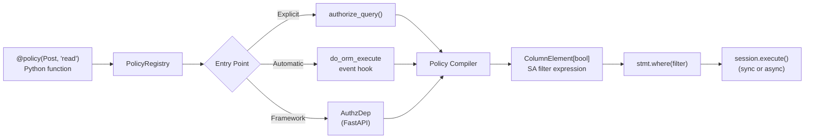

<div class="hero" markdown>


# Authorization that compiles to SQL

Define policies in Python. Get SQL WHERE clauses automatically.
No external servers, no custom DSLs.

<div class="hero-install" markdown>

```bash
pip install sqla-authz
```

[](https://pypi.org/project/sqla-authz/)
[](https://pypi.org/project/sqla-authz/)
[](https://opensource.org/licenses/MIT)

</div>

</div>

---

## See it in action

```python title="Authorization in ten lines"
from sqla_authz import policy, authorize_query
from sqlalchemy import ColumnElement, or_, select


@policy(Post, "read")
def post_read(actor) -> ColumnElement[bool]:
    return or_(Post.is_published == True, Post.author_id == actor.id)


stmt = select(Post).order_by(Post.created_at.desc())
stmt = authorize_query(stmt, actor=current_user, action="read")
# SQL: SELECT ... FROM post WHERE (is_published = true OR author_id = :id)
```

One decorator. One call. Your policy becomes a WHERE clause — evaluated by the database, not in Python.

---

## Why sqla-authz?

| Feature | sqla-authz | sqlalchemy-oso | PyCasbin | Cerbos |
|---------|:----------:|:--------------:|:--------:|:------:|
| SQL WHERE clause generation | Yes | Yes *(deprecated)* | No | Yes *(via server)* |
| SQLAlchemy 2.0 (`select()`) | Yes | No | N/A | Yes |
| `AsyncSession` support | Yes | No | N/A | No |
| Embedded (no server) | Yes | Yes | Yes | No |
| Python-native policies | Yes | No — Polar DSL | No — `.conf` files | No — YAML |
| Type-safe (pyright strict) | Yes | No | No | No |

---

## How it works



Policies are registered in a central `PolicyRegistry`. Whichever entry point you use — explicit `authorize_query()`, the automatic `do_orm_execute` hook, or a framework integration — the same compiler converts your Python function into a `ColumnElement[bool]` and appends it as a `WHERE` clause.

---

<div class="grid cards" markdown>

-   :material-rocket-launch: **Getting Started**

    ---

    Install, write your first policy, and run an authorized query in five minutes.

    [Get started](getting-started.md)

-   :material-book-open-variant: **Guide**

    ---

    Policies, relationships, point checks, session interception, configuration, and more.

    [Read the guide](guide.md)

-   :material-lightning-bolt: **Integrations**

    ---

    FastAPI and Flask integration with dependency injection and error handling.

    [Integrations](integrations.md)

-   :material-code-tags: **API Reference**

    ---

    Complete reference for all public functions, classes, and types.

    [API reference](reference/api.md)

</div>
