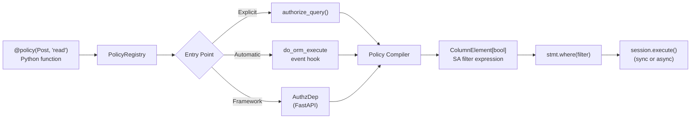

<div class="hero" markdown>


# sqla-authz

Row-level authorization for SQLAlchemy 2.0. No DSL — because why would we? Policies are just Python functions.

<div class="hero-install" markdown>

```bash
pip install sqla-authz
```

[](https://pypi.org/project/sqla-authz/)
[](https://pypi.org/project/sqla-authz/)
[](https://opensource.org/licenses/MIT)

</div>

</div>

---

## Example

```python
from sqla_authz import policy, authorize_query
from sqlalchemy import ColumnElement, or_, select


@policy(Post, "read")
def post_read(actor) -> ColumnElement[bool]:
    return or_(Post.is_published == True, Post.author_id == actor.id)


stmt = select(Post).order_by(Post.created_at.desc())
stmt = authorize_query(stmt, actor=current_user, action="read")
# SQL: SELECT ... FROM post WHERE (is_published = true OR author_id = :id)
```

---

## How it works



Policies are registered in a `PolicyRegistry`. The compiler converts your Python function into a `ColumnElement[bool]` and appends it as a `WHERE` clause. The same policies work with both `Session` and `AsyncSession`.

- No policy for a `(model, action)` pair → `WHERE FALSE` (deny by default)
- No external server or sidecar — runs in-process
- No custom DSL — policies are plain Python functions with type annotations

---

- [Getting Started](getting-started.md) — Installation, first policy, core concepts
- [Guide](guide.md) — Policies, relationships, point checks, session interception, configuration
- [Integrations](integrations.md) — FastAPI
- [Testing](testing.md) — Mock actors, assertion helpers, pytest fixtures
- [API Reference](reference/api.md) — All public functions, classes, and types
- [Changelog](reference/changelog.md)
