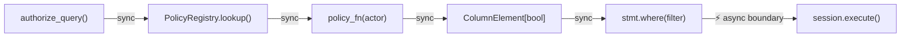

# Async Support

## The Key Insight

`authorize_query()` is **always synchronous**. It builds filter expressions using pure Python — no I/O, no database calls, no `await`. The async boundary exists only at `session.execute()`.

This means the **same policy code** works identically for both `Session` and `AsyncSession`.

## AsyncSession Usage

=== "Async"

    ```python
    from sqlalchemy.ext.asyncio import AsyncSession, create_async_engine, async_sessionmaker
    from sqlalchemy import select
    from sqla_authz import authorize_query

    engine = create_async_engine("sqlite+aiosqlite:///app.db")
    async_session = async_sessionmaker(engine, expire_on_commit=False)

    async def get_posts(current_user) -> list[Post]:
        async with async_session() as session:
            stmt = select(Post)
            stmt = authorize_query(stmt, actor=current_user, action="read")  # sync!
            result = await session.execute(stmt)  # async boundary
            return list(result.scalars().all())
    ```

=== "Sync"

    ```python
    from sqlalchemy import create_engine, select
    from sqlalchemy.orm import Session
    from sqla_authz import authorize_query

    engine = create_engine("sqlite:///app.db")

    def get_posts(current_user) -> list[Post]:
        with Session(engine) as session:
            stmt = select(Post)
            stmt = authorize_query(stmt, actor=current_user, action="read")  # same!
            result = session.execute(stmt)
            return list(result.scalars().all())
    ```

## Why It Works

The entire sqla-authz pipeline is synchronous:



1. **Policy lookup** — dictionary access (sync)
2. **Policy evaluation** — Python function call returning SA expression (sync)
3. **Filter application** — `stmt.where()` builds a new Select object (sync)
4. **Execution** — `session.execute()` is the only I/O operation (sync or async)

## Policies Are Always Sync

Policy functions never need `async def`:

```python
@policy(Post, "read")
def post_read(actor) -> ColumnElement[bool]:  # Always sync
    return or_(Post.is_published == True, Post.author_id == actor.id)
```

The policy returns a `ColumnElement[bool]` — a description of a SQL filter, not the result of executing it.

## Session Interception and Async

The `do_orm_execute` event fires on the **inner sync session**, even when using `AsyncSession`. This means:

- Event handlers are always sync
- `authorized_sessionmaker` works with sync `sessionmaker` only
- For async usage, use `authorize_query()` directly in your async code

```python
# For async applications, use authorize_query() directly:
async def list_items(session: AsyncSession, actor, action="read"):
    stmt = select(Item)
    stmt = authorize_query(stmt, actor=actor, action=action)
    result = await session.execute(stmt)
    return list(result.scalars().all())
```

## Testing with aiosqlite

Install the testing extra for async test support:

```bash
pip install sqla-authz[testing]
```

This includes `aiosqlite` for async SQLite testing:

```python
import pytest
from sqlalchemy.ext.asyncio import create_async_engine, AsyncSession

@pytest.fixture
async def async_engine():
    engine = create_async_engine("sqlite+aiosqlite:///:memory:")
    async with engine.begin() as conn:
        await conn.run_sync(Base.metadata.create_all)
    yield engine
    await engine.dispose()
```

!!! info "Same Policies, Different Execution"
    Your authorization policies are written once and work with both sync and async sessions. Only the `session.execute()` call changes.

!!! warning "authorized_sessionmaker Is Sync Only"
    `authorized_sessionmaker` creates a sync `sessionmaker`. For async applications, use `authorize_query()` directly in your async endpoints.
