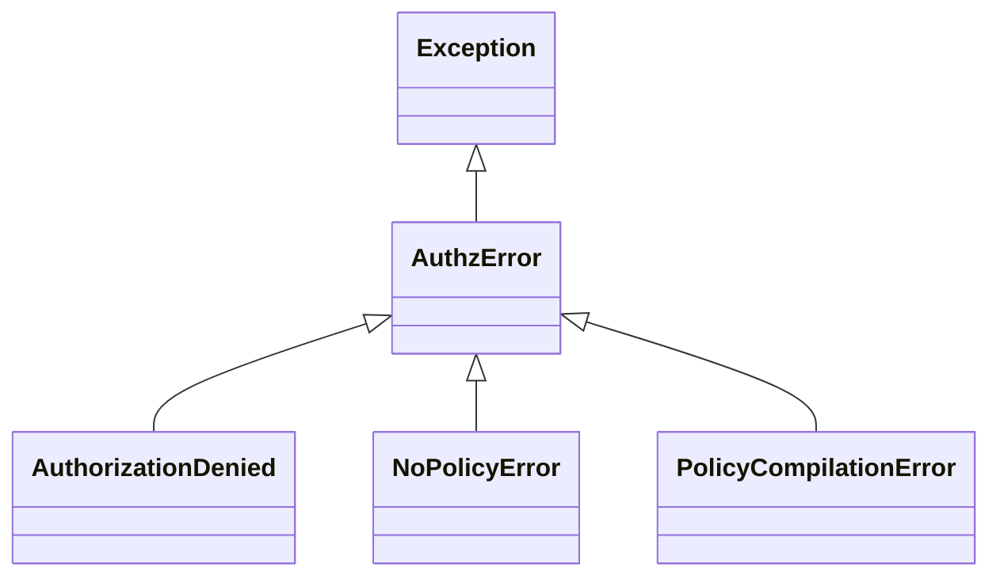

# Exception Reference

All exceptions raised by sqla-authz inherit from `AuthzError`, making it easy to catch any library error with a single `except` clause.

## Exception Hierarchy



---

## AuthzError

**Base class for all sqla-authz exceptions.**

Use this when you want a catch-all for any error originating from this library.

```python
from sqla_authz.exceptions import AuthzError

try:
    results = session.execute(authorize_query(stmt, actor=user, action="read"))
except AuthzError as exc:
    logger.error("Authorization failure: %s", exc)
    raise
```

**When to catch:** Top-level error handlers, middleware, or anywhere you want to treat all sqla-authz errors uniformly without distinguishing between subtypes.

---

## AuthorizationDenied

**Raised by `authorize()` when a point-check fails.**

`authorize()` is the raising counterpart to `can()`. It performs a synchronous boolean check (no database query) and raises `AuthorizationDenied` when the actor is not permitted to perform the action.

### Attributes

| Attribute | Type | Description |
|-----------|------|-------------|
| `actor` | `ActorLike` | The actor that was denied |
| `action` | `str` | The action that was attempted |
| `resource_type` | `type` | The model class the actor was checked against |

### Example

```python
from sqla_authz import authorize
from sqla_authz.exceptions import AuthorizationDenied

try:
    authorize(actor=current_user, action="delete", resource=Post)
except AuthorizationDenied as exc:
    print(f"{exc.actor} cannot perform '{exc.action}' on {exc.resource_type.__name__}")
    # e.g. "User(id=42) cannot perform 'delete' on Post"
```

### When to catch

- **Framework error handlers** — Convert to HTTP 403 responses in FastAPI/Flask. The built-in integrations (`install_error_handlers`, `AuthzExtension`) do this automatically.
- **Point checks with `authorize()`** — When you need to branch on authorization failure rather than let it propagate.

### Framework handler example

```python
from fastapi import Request
from fastapi.responses import JSONResponse
from sqla_authz.exceptions import AuthorizationDenied

async def authz_denied_handler(request: Request, exc: AuthorizationDenied) -> JSONResponse:
    return JSONResponse(
        status_code=403,
        content={"detail": f"Forbidden: cannot {exc.action} {exc.resource_type.__name__}"},
    )
```

---

## NoPolicyError

**Raised when no policy is registered for a `(model, action)` pair and `on_missing_policy="raise"` is configured.**

By default, sqla-authz uses deny-by-default: a missing policy produces `WHERE FALSE` and returns zero rows silently. Set `on_missing_policy="raise"` to surface unregistered policy lookups as hard errors instead.

### Attributes

| Attribute | Type | Description |
|-----------|------|-------------|
| `resource_type` | `type` | The model class with no registered policy |
| `action` | `str` | The action that has no policy |

### Example

```python
from sqla_authz import configure
from sqla_authz.exceptions import NoPolicyError

# Opt in to raising on missing policies
configure(on_missing_policy="raise")

try:
    results = session.execute(authorize_query(stmt, actor=user, action="publish"))
except NoPolicyError as exc:
    print(f"No policy registered for {exc.resource_type.__name__!r} / {exc.action!r}")
    # e.g. "No policy registered for 'Post' / 'publish'"
```

### When to catch

- **Development debugging** — Quickly surface any `authorize_query()` call that targets an unregistered `(model, action)` pair.
- **CI/CD policy coverage checks** — Run your test suite with `on_missing_policy="raise"` to enforce that every queried entity has a corresponding policy registered.

### CI/CD pattern

```python
# conftest.py
import pytest
from sqla_authz import configure

@pytest.fixture(autouse=True)
def strict_policy_mode():
    configure(on_missing_policy="raise")
    yield
    configure(on_missing_policy="deny")  # reset to default
```

---

## PolicyCompilationError

**Raised when a policy function returns a value that cannot be compiled into a SQL expression.**

Policies must return a `ColumnElement[bool]` — a SQLAlchemy filter expression. If a policy function returns `None`, a plain Python `bool`, or any other non-expression value, the compiler raises `PolicyCompilationError` rather than silently producing incorrect SQL.

### When it's raised

- Policy function returns `None` (e.g., forgot a `return` statement)
- Policy function returns a Python `bool` instead of a SA expression
- Policy function returns an incompatible SQLAlchemy construct

### Example

```python
from sqla_authz import policy
from sqla_authz.exceptions import PolicyCompilationError

@policy(Post, "read")
def read_posts(actor, query):
    # BUG: returns a Python bool, not a ColumnElement
    return actor.is_admin  # <-- raises PolicyCompilationError at query time

# Correct version:
@policy(Post, "read")
def read_posts(actor, query):
    return Post.is_published == True  # ColumnElement[bool]
```

### When to catch

- **Policy development and debugging** — Wrap `authorize_query()` calls in tests to get actionable error messages when writing new policies.
- **Not in production** — This exception indicates a programming error in a policy function. Fix the policy; do not silently handle this exception in application code.

### Debugging pattern

```python
from sqla_authz.exceptions import PolicyCompilationError

try:
    stmt = authorize_query(select(Post), actor=user, action="read")
except PolicyCompilationError as exc:
    print(f"Policy compilation failed: {exc}")
    raise  # always re-raise in production
```
